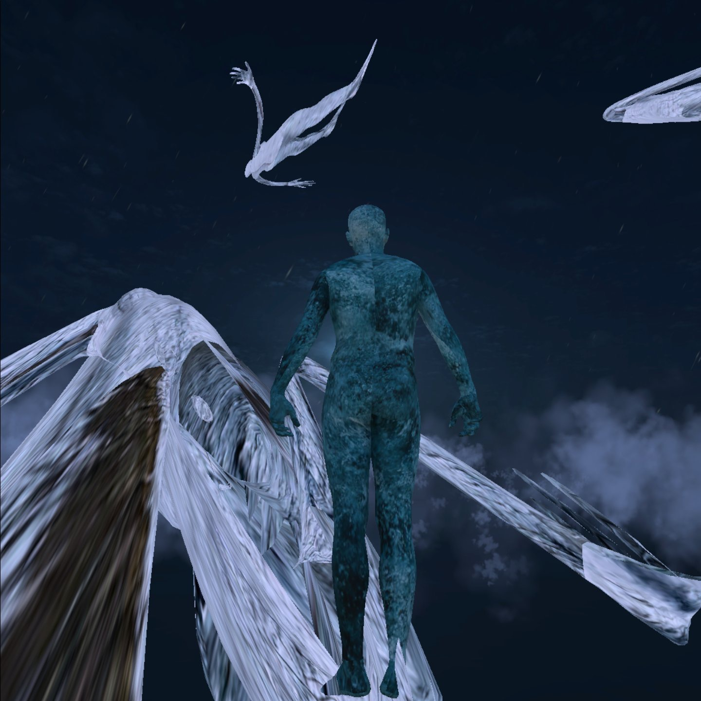

# Documentation of *Aletsch* - A VR Experience 

## Vision
What if there was a virtual portal to a glacier grounded in (real-time) data but blurred by fiction? An ever-changing digital twin of sorts, reflecting a real part of our world while opening up our experience beyond the factual? My goal was to create an experience that would bring users (immersants - borrowed from Char Davies) closer to the mightiest glacier of the Alps through data, a more scientific approach, and fictional tales, a more mystical approach. Throughout working on this project, I tried to stay as close to the site - the Aletsch Glacier - as I felt was reasonable. In the following I will describe the different ideas I tried along the way, contextualizing the final result for the reader.

Project files and playthroughs can be found here: https://owncloud.gwdg.de/index.php/s/uvsqIHPixqjVZAt PW: aletsch

## Initial Idea 
The idea to create an immersive VR experience about a glacier as my first term project came to mind early in the semester. Initially, I proposed to create a social VR experience about the disappearance of a glacier, in which three people initially experience the glacier separately, before meeting in the passthrough mode of their *Meta Quest 2*s, as the glacier melts away. When I began to think about how I could design the glacier, my advisor Alex pointed me toward Digital Elevation Models (DEMs), leading me in the direction the project eventually took. 

## Digital Elevation Models from Swisstopo

A DEM "is a 3d computer graphics representation of elevation data to represent terrain or overlaying objects, commonly of a planet [...]" [1]. The Federal Office of Topography swisstop has rather impressively LiDAR-scanned the whole of Switzerland, making all the data available to the public in the form of a few databases. After some trying around, I decided to see whether the Internet could help me figure out how to get this data as a mesh and into Unity. I came across this video: https://www.youtube.com/watch?v=XHBkeU4jQ98 and followed it closely, which helped me get a 1km2 mesh of part of the glacier into Unity [2]. I experimented with a lot of different sections of the glacier but found that some of the meshes were more interesting/more detailed than others. Also, the glacier is roughly 20 km long, so I decided to use a specific part of the glacier for my experience. I decided to focus on the glacier and omit the surrounding mountains, creating a wide open space that is somewhat abstract and removed from its context. 

Researching DEMs I became interested in the ways artists have used geographical data. I became very interested in James Bridle's writing and art (in particular his book "Ways of Being"), the *Internet of Animals* [13] and the *terra0* project [14]. Alex put me onto the work of Jakob Kudsk Steensen. This led me to the idea of the digital twin and its possible uses in artistic contexts.  

### Digital Twins in Artistic Contexts?
The importance of applying digital twins to the natural world has only gained importance as environmental disasters are ever more frequent. Resource management and disaster management can benefit from the use of digital twins. This rising need coincides with a booming tech sector, with projects like "Copernicus" [8] and "Destination Earth" [9] attempting to create a digital twin of the Earth. To create an approximation of a digital twin of the Aletsch Glacier, I decided to use the DEM models previously discussed and live weather data from OpenWeatherMap.org. The live data aspect that is integral to the idea of a digital twin seemed like an interesting connection to performance and thus led me to the topic of liveness. 

#### Liveness
Much of my passion for theatre and performance stems from classical liveness and the feeling of intimacy this can conjure. I am interested in different forms of liveness afforded to us by technology and wondered what potential there was in liveness beyond the human or humanoid. What if liveness' intimacy could be experienced not only with a human or a chatbot but in some way with something as profoundly different from us as a glacier? Being able to (virtually) experience the same weather that the glacier was being subjected to felt like an exciting prospect. It felt intimate, strangely enough. 

### Fiction
Beyond building an experiential, partial digital twin of the Aletsch Glacier, I wanted to explore more fictional elements in my work. With site-specificity being an overarching guideline, I explored Swiss mythology and soon came across www.maerchenstiftung.ch, which hosts a large pool of Swiss tales. I ended up writing a character based on two tales, one of which tells a story situated at the Aletsch Glacier and the other in the same Canton Wallis. I expand upon this in the section "Narrative". 

# Production 

## The Weather Machine
At the core of my project is the real-time weather simulation. Seeing that the glacier is an expression of climate and climate expresses itself through weather [3], a real-time weather simulation seemed to be an apt choice for this glacier experience. Aesthetically, I aimed at a heightened realism (confined by the graphical ability of the *Meta Quest 2*) that would emphasize the weather conditions: if it's clear skies at the Aletsch Glacier, I want everything in VR to feel bright; if it's cloudy, I want the users of the experience to be immersed in clouds. 

Early prototyping results:

### Static Skyboxes & The Quasi-Live Weather Simulation
I initially considered creating a dynamic skybox, where the position of the sun would be determined by the real-time data. But to create the intended atmosphere, I decided to use static skyboxes [15], which look more dramatic than anything I would've achieved dynamically in the available time. Therefore, the weather simulation is quasi-live: an API call is made once at the beginning of the experience, but isn't updated until the next (and final) scene. A dynamic weather system would allow immersants to, for instance, watch the sunset. Ideally, the weather would be live throughout the experience and the skyboxes would be stunning, but I felt like within the scope of the first-term project this was an either-or situation. 

### Weather & Narrative 
I struggled between attempting to present the weather as is and creating a stylized, artistically-interpreted aesthetic. In the end, I opted for something in between but decided I wanted to use the weather data to affect the narrative in some way too. Otherwise, the two parts would've been completely separate, begging the question of why live weather data with narrative in the first place. The weather data influences the "Arme Seelen" avatars by animating their movement with wind speed and wind gust values and determining their color based on the temperature. Rather than using animation to move the avatars, I used a shader to do so. This provided a straightforward and interesting way of moving the avatars. I clamped the temperature range between -20 and 20 degrees Celsius, with -20C resulting in a saturated blue and +20C in a saturated red. Values in between are mapped accordingly, with white signifying a temperature somewhere around 0 degrees Celsius. I did this because the story I created is one where the ghosts are *part of* the glacier. 

### Implementation Process
I began by setting up an API Key for the "Current Weather" data provided by OpenWeatherMap.org and figuring out how to make an API call in Unity. As I had never worked with an API in this manner before, I was surprised by how easy it was to access the weather data. I then decided to use static skyboxes, for reasons I've explained, and set out to find ones I liked, settling for the *AllSky* asset bundle from the Unity Asset Store. I got it 50% off. 

#### Skybox
The code for setting the skybox is quite basic, just a range of if-else clauses determining whether it's day/night time, clear sky/overcast etc. What took me a while to figure out was how to set up skyboxes during runtime. What I wasn't able to accomplish was to set up the lighting at runtime - I baked everything beforehand. I think this is also the way to go considering VR's performance limitations, but I might be wrong. This meant that for a few of the skyboxes, I had to set up lighting that would match the skybox. Some of the lighting isn't quite perfect, unfortunately, and I'm sure there's a better way of doing this. 

#### Fog/Clouds

Once the skyboxes were set up, I began working on fog/clouds. While the skyboxes do depict clouds, one is often completely immersed in them high up in the mountains. I used Unity's ParticleSystem class, creating a few instances and placing them around the scene. I followed tutorials, tweaking parameters as I went along. I wasn't able to simulate the heavy fog one encounters in the mountains, but I overall feel like they add to the atmosphere. 

#### Precipitation 

The final major weather aspect I implemented was precipitation. I created one "snow" particle system and one "rain" particle system, which are triggered by the API's precipitation value and the temperature. I followed several tutorials, again tweaking the results as needed. Working with a fairly wide map proved challenging, as the amount of particles needed to simulate the weather conditions was quite high. To optimize, I could adjust the particle systems so that they toggle on and off depending on the immersant's position. However, this wasn't necessary and I liked being able to see rain or snow etc. in the distance. I initially created a few smaller rain and snow particle systems dispersed throughout the map, which followed the immersant, but the results weren't of use. 

Aside from precipitation and temperature values, I also used the API's wind intensity to control the "noisiness" of the precipitation: high wind intensity makes the snow or rain at an angle, low wind intensity and the rain/snow falls in a rather straightforward trajectory. I did this using Unity's "Wind Zone", controlling the values with the OpenWeatherMap values. 

### Implementation Challenges 
One of the main challenges was also what makes this approach interesting to me, namely the dynamic nature of the system. If I change a parameter of the rain system, how does that affect everything else? I spent hours mapping the values and many more tweaking them. After all, there is no obvious way of connecting the API's values with the various parameters one can set in Unity. The conceptual work is figuring out which values to connect - for instance, temperature with the color of the avatars. The time-intensive work is mostly comparing incrementally different values with one another, going back and forth and trying to test for all imaginable weather situations. Had I created a static weather setup, I could've spent all my time optimizing the look and atmosphere of everything, but again, that wasn't my interest. 

## A Trip to the Aletsch Gletscher  

I chose to center the experience around the Aletsch Glacier because I knew I would visit it over Christmas break. I had the privilege of spending a week on the Riederalp, a mid-mountain ski resort close to the Aletsch Glacier. I planned to do a guided tour across the glacier itself, however this fell short due to the snow conditions. Still, I set out to record sound and 3D scan some of the scenery, gathering material I would later find a use for. 

Using the apps *Scaniverse* and *Luma AI*, I scanned some moss in the Aletschwald, rocks at the ridge between Riederalp and Bettmeralp, looking straight down onto the glacier, some rocks outside of our chalet and a cross and tree I came across at Golmenegg. As this trip was a family vacation, I prioritized spending time with my family, not wanting to hold everyone up on a hike by scanning all the time. Aside from the cross, which I planned to scan, I scanned rather spontaneously, during breaks from skiing or hiking. I sought to scan the cross since the people of the villages surrounding the Aletsch Glacier have historically been deeply Catholic, something I wanted to integrate into the experience's narrative. 

The sound recordings proved to be more challenging than expected. One thing I've learned is one needs to test the technology for the exact circumstances it'll be used in. It seemed that the *Zoom H2next* was having problems with the cold temperatures, and it would continuously make cracking sounds, rendering most of my recordings unusable in their raw form. Instead, I used them as part of a granular synthesizer, with which I created the sounds reminiscent of cracking ice heard in the experience. More on that later. 

### Use of 3D-scanned Objects 
I placed the scans scattered atop the glacier mesh, the first obvious departure from digital twin "realness". They provide the immersants with something to explore and add to the narrative.

## Sound 
I decided to challenge myself and learn how to use *FMOD* to take care of the sound. FMOD integrates seamlessly with Unity and it was a real pleasure using it, as in the past I've found Unity's audio system quite painful to keep track of and not easy to make anything dynamic or adaptive with. I did however have a big scare at the very end of the production process, when I thought I needed a plugin like the Oculus Spatializer for FMOD or the Meta XR Spatializer for FMOD to get 3D sound. I spent a day trying to get the plugin to work, frustrated with myself for taking care of the sound so late in the process. Thankfully, Alex took the time for a spontaneous Zoom call and it turned out the problem I was having was glaringly simple: I just needed to use the "Object Spatializer" in FMOD rather than the "Spatializer". No need for any plugins. Sometimes it's good to take a step back and look for the easiest solution rather than rush into things. 

### Weather  
The weather machine controls the loudness of the wind soundtrack, which plays continuously, providing atmosphere. The precipitation data also controls whether the sound of rain is heard, and if so, at what volume. 

### Magical Objects 
Some of the 3D scans I use in the experience are simply there to be freely explored by the immersant. The hovering rock, the enlarged patch of moss, the tree and the cross on the other hand introduce sound beyond the weather. 

- The hovering rock plays a recording I made in Logic Pro, using a MIDI keyboard to control a modification of Logic Pro's Strings instrument. The goal was to create sounds that were reminiscent of wind, creating a bridge between the naturalistic representation of the weather and the fictional side of the experience. 

- If the immersant walks through the moss, they hear a modification of a recording I made walking through snow on the Riederalp. Again, I intended for the sound to be somewhere between "real" and fictional. 

- From the tree rings a modified field recording of cows and their bells on a mountain in Switzerland, provided by freeounds.org. Although the sound risks clichée - what could be more clichée than the sound of cows near a glacier in the Swiss Alps? - it ties into the monologue of the second part of the experience, which I will elaborate on in just a bit. 
  
- Like the cowbells, the sound coming from the cross is also relevant to the story. More on that in the "Narrative" section.  

### Falling into a Crevasse
Sound also provides the gateway to the rather abrupt scene transition, in which the immersant falls into a glacial crevasse. Inivisble colliders are situated throughout the glacier, triggering sounds reminiscent of ice cracking when the immersant walks through them. The sounds were created with a granular synthesizer I made in Logic Pro using field recordings and a recording I found on freesound.org. Each collider has a script attached to it which counts down from a certain amount of time. When the timer is up and the immersant walks through one of these colliders, the screen briefly fades to white (thanks to a simple shader) and then fades in on the final scene. So if the immersant doesn't use the controllers to move around the scene, they are stuck on the glacier. 

## Narrative 

### Swiss Mythology
The website www.maerchenstiftung.ch provides full access to hundreds of Swiss fairytales. I was keen on integrating some of these stories, as this provided a cultural element of site-specificity. At the heart of the narrative is the tale "Die Arme Seelen im Aletschgletscher" [4]. According to this tale, the crevasses of the glacier are full of "Arme Seelen" - a term associated with sinners and other ill-fated individuals often found in religious texts. The other tale I drew inspiration from and directly quoted in the experience is "Mord und Bergsturz in Madsand" [5]. In this tale, a ghost appears which embodies an unborn child that was killed when their father murdered their mother. 

### Sermon
Aside from the monologue of the unborn ghost, I edited a prayer I found on YouTube [6]. It is an "Arme Seelen Rosenkranz" - a prayer for sinners and the generally ill-fated. Connected with the cross as previously mentioned, you hear the prayer as you approach the cross. 

### "Liebe Ungeborene" - Monologue

Once the immersant falls into a crevasse, they stand suspended in the skybox. Below them swoop and swirl Arme Seelen and across from the immersant stands the unborn ghost. The script of what the ghost says - spoken by the actor Morris Weckherlin - can be found under Documentation/text/Aletsch-Texte.pdf, though Morris and I did some further editing. The impetus for the monolog was the unborn ghost from the tale "Mord und Bergsturz in Madsand", who says: "Nie habe ich einem Menschen was Leides getan [...] unschuldig bin ich zu Grunde gerichtet worden! Ich habe darum Vollmacht zur Rache und grausen Zerstörung." The monolog in the VR experience begins with a quote: "Nie habe ich einem Menschen was Leides getan... unschuldig wurde mir das Leben entrissen! Ich habe darum Vollmacht zur Rache und grausen Zerstörung". The monologue centers around the issue of suffering for the actions of those who came before. In the case of the ghost, they suffer from the actions of their parents, which lead to their demise. Tethered to the Aletsch Glacier, the ghost is once again threatened by the actions of others, this time regarding the climate crisis and the resulting near-certain disappearance of the glacier. 

Further inspiration for the monologue was the video poem "Ad Jökla - Becoming Glacier" by Anna-Sophie Balzer [7]. I translated the poem and used some of the words. They helped me describe the glacier, for instance: "Auf unseren abtragenden, absorbierenden Einfrierling" or "Verdünntes Leben. Entblösste Sammlung. Zerfließende Kraft". 

#### Implementation of Avatars
I used the SMPL-X model made by the Max-Planck Institute for Perceiving Systems in Tübingen for the unborn ghost and the Arme Seelen. I followed the instructions provided by them [10] to get the models into Unity. Initially, I wanted to animate the unborn ghost so that if you moved forward with the controllers, the unborn ghost would walk away from you, forever keeping its distance, exemplifying the separateness of the living and the dead. I downloaded motion capture material of people walking from the AMASS dataset [11], prepared it in *Blender* and exported it to Unity. I set up an "Idle" and "Walking" two-state Animation Controller but to no avail. The avatar would move, but always with a lag and very jittery. I tried editing the animations in Blender and Unity, but couldn't find the problem. Eventually, I decided to move on. The hovering unborn ghost seems like a good alternative, perhaps better than my initial idea. 

As mentioned in the weather section, I used temperature and wind data to control the shader on the Arme Seelen floating above, below and next to the immersant. I wanted them to be part of the "digital twin" rather than separate, as many of the dead one encounters in Swiss "Totensagen" are inextricably linked to the place where they died [12]. 

## Work Method 
I worked on the project throughout the semester but found that the other courses demanded most of my attention. So I started working on the project in earnest during the semester break. I used *Notion* to ideate on concept and implementation and kept track of tasks using a Kanban board. Screenshots of my Notion can be found at *Documentation/img/notion*. In hindsight, I could've combined this documentation with my Notion page, but I also found working knowing that I wouldn't have to show my every thought quite liberating. 

## Challenges 
I challenged myself throughout the project. Learning about Digital Elevation Models, GIS, etc. was fun but also completely new to me. Working with real-time data was exciting and as alluded to earlier, posed its own set of challenges. FMOD, for all its merits, did complicate things at times more than it helped. 

A challenge I set for myself but couldn't resolve was including *Desoria saltans* - a glacier flea and the sole year-round inhabitant of the Aletsch Glacier - in the experience. Fascinated by these tough insects, I read what little I could find on them and thought of ways I could include them. They are temperature sensitive and I planned on driving their appearance and behavior by the weather data. But how they might relate to the "Arme Seelen" narrative in a way that added to the experience didn't become clear to me. Their temperature sensitivity meant that they wouldn't always be around in the experience. To me, this implied that the experience would have to work without them. (Or offer something in their stead. What this something else could be, I didn't find out.) And if it worked without them, why have them appear in the first place? 

What I find most challenging about VR is finding ways of working with text. In the three VR experiences I have programmed thus far, I made use of narration and more traditional storytelling elements found i.e. in theatre. With all three experiences, I feel like the narrative form isn't quite where I want it to be. Perhaps this will be something to explore with Drehbuch/Dramaturgie students in the future, but for now, I will be taking a break from VR to explore other media in my studies. 

## References 

1. https://en.wikipedia.org/wiki/Digital_elevation_model
2. https://www.swisstopo.admin.ch/en/height-model-swissalti3d
3. Seitter, Keith L. (2023) "Viewing Weather as the Expression of Climate" *Bulletin of the American Meteorological Society.* 22 Sep 2023, DOI: https://doi.org/10.1175/BAMS-D-23-0154.1 
4. "Die Arme Seelen im Aletschgletscher" *Walliser Sagen, gesammelt und herausgegeben von Josef Guntern, Olten 1963* https://www.maerchenstiftung.ch/de/maerchen_aus_aller_welt/schweizer_maerchen_zum_lesen_und_vorlesen/maerchensuche/8164/die-armen-seelen-im-aletschgletscher Last accessed 16 March 2024
5. "Mord und Bergsturz in Madsand." https://www.maerchenstiftung.ch/de/maerchen_aus_aller_welt/maerchen_aus_der_fernen_heimat/maerchensuche_ferne_heimat/9654/mord-und-bergsturz-in-madsand Last accessed 16 March 2024
6. LINK TO ARME SEELEN GEBET
7. "Ad Jökla - Becoming Glacier" https://www.youtube.com/watch?v=hgkFDRO0llI
8. Copernicus Project. https://www.copernicus.eu/en
9. Destination Earth. https://digital-strategy.ec.europa.eu/en/policies/destination-earth
10. SMPL-X https://smpl-x.is.tue.mpg.de
11. AMASS https://amass.is.tue.mpg.de 
12. Gattlen, Anton (1948) "Die Totensagen des Alemannischen Wallis" *Universität Freiburg (Schweiz)*
13. https://www.icarus.mpg.de/28546/icarus-internet-of-animals
14. https://terra0.org
15. https://assetstore.unity.com/packages/2d/textures-materials/sky/allsky-220-sky-skybox-set-10109
    
