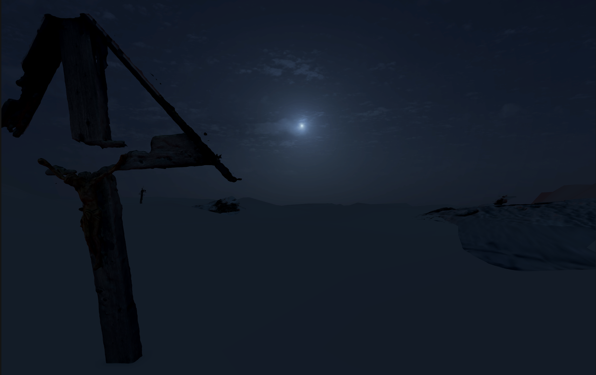

# *Aletsch* (Working title) - VR Experience 

## Description 

Using real-time weather data and Digital Elevation Models, *Aletsch* is a live Virtual Reality portal to a small section of the mightiest glacier of the Alps. A reoccurent subject of Swiss mythology, *Aletsch* seeks to embed narrative fiction in an environement constantly in flux. 

### Setting the Scene 
Some ten billion tons of ice constitute the Aletsch Glacier in Switzerland. The glacier is a shapeshifter, growing in winter and melting in summer. In an effort to stay as close to the site as possible, the terrain the experiencers navigate through are based on Digital Elevation Models from Switzerland's Federal Office of Topograhpy swisstopo. Drawing from the swissALTI3D database [2], the experience's terrain is based on a 2019 comprehensive LiDAR scan of the Aletsch Glacier, up to a resolution of 0.5 meters. Due to the sheer size of the glacier, the experience is confined to a section of the glacier where I found the data to be of the highest resolution. 

### Weather as Character 
Formed over long periods of time, glaciers are existentially intertwined with their climate. While it is difficult for us to recognize climate, we experience weather, the expression of climate [1]. By controlling the sky, clouds, wind and precipitation of the VR experience with real-time weather data provided by OpenWeatherMap, the experience seeks to highlight the importance of climate (as expressed by weather) for glaciers whilst also introducing an element of liveness, creating a temporal bond between the experiencer and the glacier. I originally planned for the glacier to melt away during the experience (as is likely to happen by the end of the century [SRC]), but decided this was too dramatic and on the nose. Instead, I introduce *Desoria saltans*: a small springtail that is the sole year-round inhabitant of the glacier and thrives at about 0 degrees celsius [4]. A simulation of the temperature-sensitive critters is driven by the weather data, providing a visualisation of the temperature and its impact on the *Desoria saltans*, whose existence depends on the endangered glacier. 

- Live Weather data, *Desoria saltans*

### Hidden in the Glacier 
- Mythological aspect, 3D scans, "Die Arme Seelen im Aletschgletscher" [3]

## Worst-Case Scenario 

## Best-Case Scenario 

## Nice to have 
* Cross reference live weather data with historical data, change shading or overall aesthetic depending on weather anomalies, which can point toward climate change

## Timetable 

## References 
1. "Viewing Weather as the Expression of Climate" https://journals.ametsoc.org/view/journals/bams/104/9/BAMS-D-23-0154.1.xml
2. "swissALTI3D" https://www.swisstopo.admin.ch/en/geodata/height/alti3d.html
3. "Die Arme Seelen im Aletschgletscher" https://www.maerchenstiftung.ch/de/maerchen_aus_aller_welt/schweizer_maerchen_zum_lesen_und_vorlesen/maerchensuche/8164/die-armen-seelen-im-aletschgletscher
4. "Glacier flea" https://www.swisseduc.ch/glaciers/glossary/gletscherfloh-en.html
