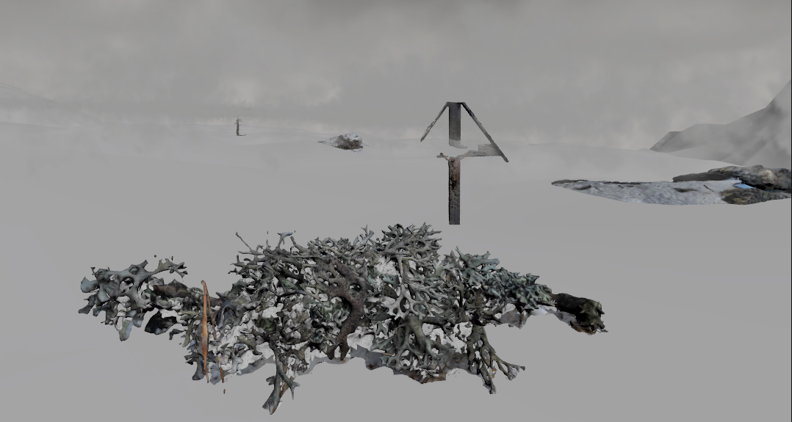

# *Aletsch* (Working title) - VR Experience 

## Description 

Grounded in real-time weather data and Digital Elevation Models, *Aletsch* is a live Virtual Reality portal to a small section of the mightiest glacier of the Alps. A reoccurent subject of Swiss mythology, *Aletsch* seeks to embed narrative fiction in an environement constantly in flux. 

### Setting the Scene 
Some ten billion tons of ice constitute the Aletsch Glacier in Switzerland. The glacier is a shapeshifter, growing in winter and melting in summer. In an effort to stay as close to the site as possible, the terrain the experiencers navigate through with their controllers are based on Digital Elevation Models from Switzerland's Federal Office of Topograhpy *swisstopo*. Drawing from the swissALTI3D database [2], the terrain is based on a 2019 comprehensive LiDAR scan of the Aletsch Glacier, with a resolution of up to 0.5 meters. Due to the sheer size of the glacier, the experience is confined to a subsection where I found the data to be of the highest resolution. 

### Weather as Character 
Formed over long periods of time, glaciers are existentially entangled with their climate. While it is difficult for us to recognize climate, we experience weather, the expression of climate [1]. By controlling the sky, clouds, wind and precipitation of the VR experience with real-time weather data provided by *OpenWeatherMap*, the experience seeks to highlight the importance of climate (as expressed by weather) for glaciers whilst also introducing an element of liveness, creating a temporal bond between the experiencer and the glacier. I originally planned for the glacier to melt away during the experience (as is likely to happen by the beginning of the next century [SRC]), but decided this was too dramatic and on the nose. Instead, I introduce *Desoria saltans*: a small springtail that is the sole year-round inhabitant of the glacier and thrives at about 0 degrees celsius [4]. A simulation of the temperature-sensitive critters is driven by the weather data, providing a signifier of the temperature and its impact on the *Desoria saltans*, whose existence depends on the endangered glacier and its cold climate.  

### Hidden in the Glacier 
Advancing during the Little Ice Age (which spanned from the 16th to the 19th century [5]), the glacier destroyed farms and threatened the survival of humans and various animals and plants in the vicinity. Religion was called upon to counter the advancing glacier: processions were held [6], crosses were erected [6]. The glacier was seen as a form of hell for sinners, "Arme Seelen" [3], who were banished to the glacier crevasses [7]. Based on this history and on Swiss "Totensagen" [8], *Aletsch* features one of these pour souls as a ghost inhabitant of the glacier, whose story we are told and whom we might find roaming the ice. The ghost is animated as a SMPL-X avatar. 

## Worst-Case Scenario 
* Rudimentary weather system: simulating clouds; dusk, day, dawn and night skyboxes; wind strength controls loudness of wind sound effects
* 1km2 model of a section of the Aletsch Glacier
* A little buggy, i.e. during more compute intensive weather conditions 
* Minimal sound design reduced to wind sound effects 
* "Arme Seele" avatar behavior fully predetermined 

## Best-Case Scenario 
* Maximal use of OpenWeatherMap's data, wind speed effecting clouds, snow and rain affecting sound, etc.
* Robust throughout various weather conditions
* Voice-over narrated by an actor and written by me 
* Simulation of glacier fleas tied to current temperature 
* Interaction with the weather (tbd)
* Locomotion dependent on glacier mesh/collider, temperature (i.e. slower movement when its colder)
* "Arme Seele" avatar reactive to weather conditions 

## Nice to have 
* Cross reference live weather data with historical data, change shading or overall aesthetic depending on weather anomalies, which can point toward climate change
* Glacier mesh has custom texture 
* Religious procession sound fragments spatially tied to the 3D-scanned Cross  

## Timetable 
| Week         | Objectives | Notes
|--------------|-----------|--------------|
| 8.1. - 14.1. | Write project plan, iterate over weather simulation | First term project week
| 15.1. - 21.1.| Figure out how to tie the different aspects (weather, fleas, myth) together, overall user experience | Tue: Homework CC1/TBAG 
| 22.1. - 28.1.| Fix clouds and implement precipitation | Wed: Academic Readings Presentation
| 29.1. - 4.2. | Introduce avatar, write Arme Seele, figure out the non-linear storytelling | Thu: Deadline TI tutorials, Thu-Sat: Transmediale 
| 5.2. - 11.2. | Refine weather and/or add *Desoria saltans*  |
| 12.2. - 18.2. | Record voice over w actor | Zurich + Black Forest
| 19.2. - 25.2. | Try to tie the elements together | Brändle 
| 26.2. - 3.3. | focus on CC1 & TBAG | Thu: DEADLINE CC1 & TBAG final project 
| 4.3. - 10.3. | Finish weather system, tie elements together, optimisation | 
| 11.3. - 14.3. | Fine tuning, nice to have |
| 15.3. |  FINISHED! Hand everything in | 

## References 
1. "Viewing Weather as the Expression of Climate" https://journals.ametsoc.org/view/journals/bams/104/9/BAMS-D-23-0154.1.xml
2. "swissALTI3D" https://www.swisstopo.admin.ch/en/geodata/height/alti3d.html
3. "Die Arme Seelen im Aletschgletscher" https://www.maerchenstiftung.ch/de/maerchen_aus_aller_welt/schweizer_maerchen_zum_lesen_und_vorlesen/maerchensuche/8164/die-armen-seelen-im-aletschgletscher
4. "Glacier flea" https://www.swisseduc.ch/glaciers/glossary/gletscherfloh-en.html
5. "Little Ice Age" https://en.wikipedia.org/wiki/Little_Ice_Age
6. Holzhauser, Hanspeter. "Die Bewegte Vergangenheit des Grossen Aletsch Gletschers". Vergangenheit_Aletsch.pdf 
7. "Der Aletschgletscher" https://storymaps.arcgis.com/stories/aec89b11183e42a7aad006c842855db8
8. Gattlen, Anton. "Die Totensagen des Alemannischen Wallis" DieTotensagen.pdf

   
